# Анализ исходных файлов и папок к заданию

Исходные данные представлены в ресурсах ```SportStore.7z```

- Описание предметной области
- Сессия 1
- Требования и рекомендации
- Руководство по стилю
- Общие ресурсы

# Подготовка удаленного репозитория с файлами .gitignore и readme.md на git.scc, подготовка локального репозитория 

1. Зайти на ```git.scc```. Учетные данные совпадают с сетевым именем студента
2. Создать репозиторий c именем ```SportStore```. При создании репозитория инициализировать создание файла ```.gitignore``` для Visual Studio и файла ```readme.md```, поменять название главной ветки с ```main``` на ```master```.

# Анализ структуры скрипта для выбраного сервера (mssql server)

В любом текстовом редакторе (VSC, блокнот) открыть файл скрипта для SQL Server (mssql.sql)

Изначальный вид скрипта представлен в листинге 1:

**Листинг 1. Исходный скрипт базы данных mssql.sql**

```sql

create database [Trade]
go
use [Trade]
go
create table [Role]
(
	RoleID int primary key identity,
	RoleName nvarchar(100) not null
)
go
create table [User]
(
	UserID int primary key identity,
	UserSurname nvarchar(100) not null,
	UserName nvarchar(100) not null,
	UserPatronymic nvarchar(100) not null,
	UserLogin nvarchar(max) not null,
	UserPassword nvarchar(max) not null,
	UserRole int foreign key references [Role](RoleID) not null
)
go
create table [Order]
(
	OrderID int primary key identity,
	OrderStatus nvarchar(max) not null,
	OrderDeliveryDate datetime not null,
	OrderPickupPoint nvarchar(max) not null
)
go
create table Product
(
	ProductArticleNumber nvarchar(100) primary key,
	ProductName nvarchar(max) not null,
	ProductDescription nvarchar(max) not null,
	ProductCategory nvarchar(max) not null,
	ProductPhoto image not null,
	ProductManufacturer nvarchar(max) not null,
	ProductCost decimal(19,4) not null,
	ProductDiscountAmount tinyint null,
	ProductQuantityInStock int not null,
	ProductStatus nvarchar(max) not null,
)
go
create table OrderProduct
(
	OrderID int foreign key references [Order](OrderID) not null,
	ProductArticleNumber nvarchar(100) foreign key references Product(ProductArticleNumber) not null,
	Primary key (OrderID,ProductArticleNumber)
)


```

В ```листинге 1``` на языке SQL создается база данных (по умолчанию имя Trade) и таблицы ```Role```, ```User```, ```Order```, ```Product```, ```OrderProduct```. При этом таблицы ```User``` и ```Role``` связаны связью 1:М, а таблица ```OrderProduct``` является связующей таблице между таблицами ```Order``` и ```Product```. Это можно понять по внешним ключам (foreign key).

    При анализе скрипта можно отметить следующие факты:

- Все атрибуты таблиц имеют префиксы названия таблицы (например первичный ключ ProductID в таблице ```Products```)

- В таблице ```Product``` в поле ```ProductPhoto``` указан тип данных ```image```, который предполагает, что изображения в базе данных будут храниться в виде двоичных бинарных файлах.

- Также в таблице ```Product``` в качестве первичного ключа указан ключ ```ArticleNumber``` строкового типа данных

- В атрибутах, где надо указывать дату поставлен тип данных ```datetime```, что является избыточным.

Стоит отметить тот факт, что работа разработка приложения данных планируется вести через ORM **Entity Framework**. Для этого надо обеспечить поле ```Id``` числового типа у каждой таблицы и убрать префиксы названия таблицы у атрибутов.

Скрипт после редактирования представлен в **листинге 2**.

**Листинг 2**. Отредактированный скрипт базы данных
```sql

create database [SportStore]
go
use [SportStore]
go
create table [Role]
(
	Id int primary key identity,
	Name nvarchar(100) not null
)
go
create table [User]
(
	Id int primary key identity,
	Surname nvarchar(100) not null,
	Name nvarchar(100) not null,
	Patronymic nvarchar(100) not null,
	Login nvarchar(max) not null,
	Password nvarchar(max) not null,
	Role int foreign key references [Role](Id) not null
)
go
create table [Order]
(
	Id int primary key identity,
	Status nvarchar(max) not null,
	DeliveryDate date not null,
	PickupPoint nvarchar(max) not null
)
go
create table Product
(
    Id int primary key identity,
	ArticleNumber nvarchar(100) unique,
	Name nvarchar(max) not null,
	Description nvarchar(max) not null,
	Category nvarchar(max) not null,
	Photo varchar(max) not null,
	Manufacturer nvarchar(max) not null,
	Cost decimal(19,4) not null,
    DiscountAmount tinyint null,
	QuantityInStock int not null,
	Status nvarchar(max) not null,
)
go
create table OrderProduct
(
    Id int primary key identity,
	OrderId int foreign key references [Order](Id) not null,
	ProductId int foreign key references [Product](Id) not null,
)

```

# Создание проекта приложения WPF

1. Запустите Visual Studio 2022


2. Выберите проект WPF (Microsoft)

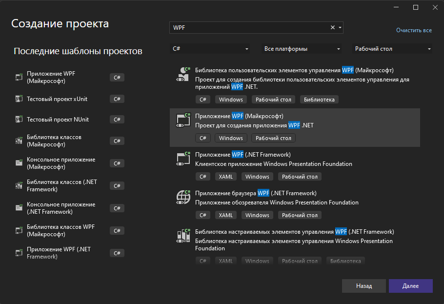

3. Название проекта и решения: **SportStore**


4. Платформа: .NET 6.0

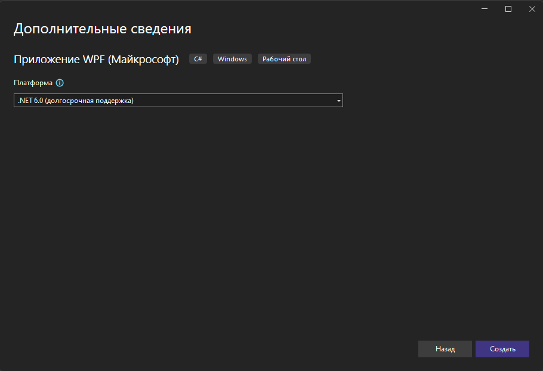


5. Начальное окно с разметкой и контруктором

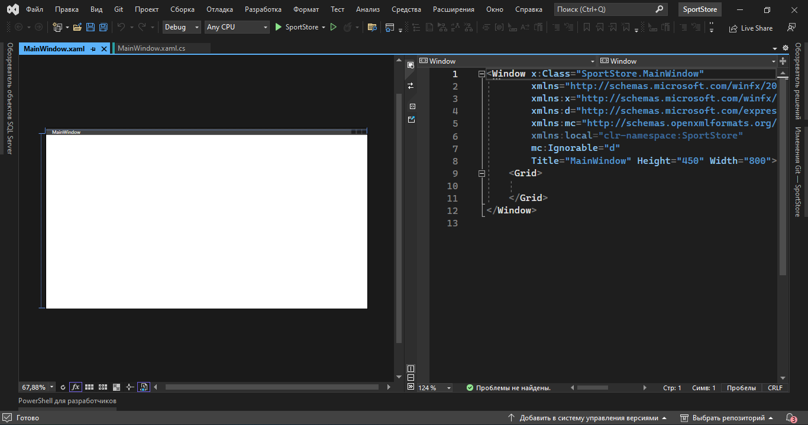

6. Обозреватель решений

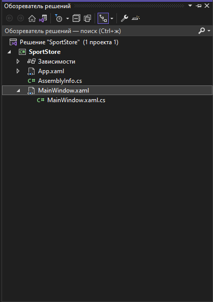

7. Обозреватель объектов SQL Server


# Развертывания скрипта на сервере баз данных 

1. Создаем запрос

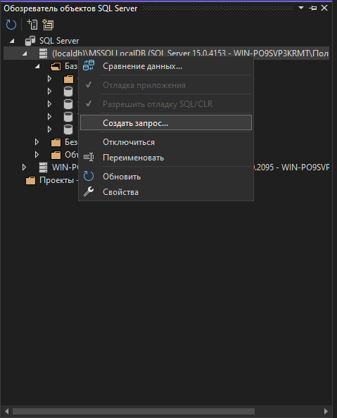

2. Поместите запрос из **листинга 2**

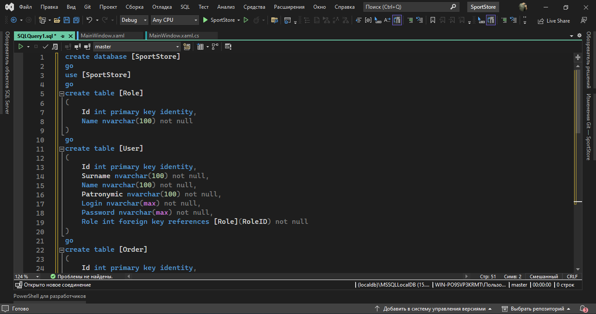

3. Анализ запроса на ошибки

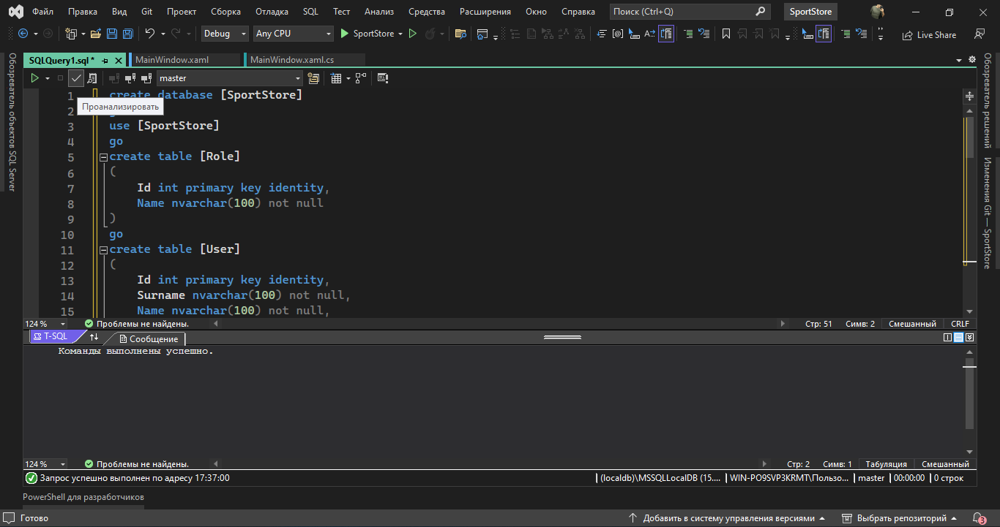

4. Выполнение скрипта

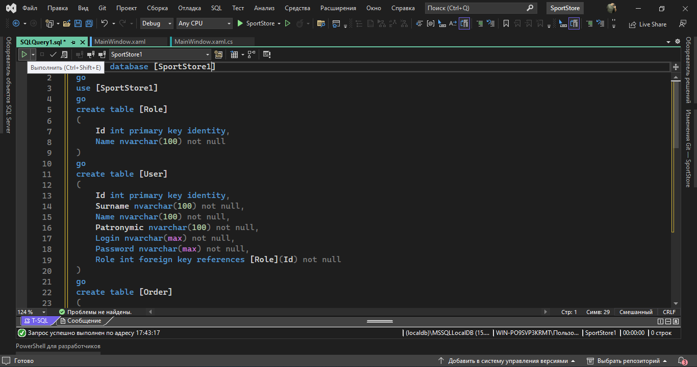

5. Развертывание скрипта на сервере


6. Сохранить готовый вариант в текстовый файл ```database.sql```


# Создание ERD - диаграммы базы данных

В ```MSSQL Management Studio``` или ```Dbeaver``` создайте ERD - диаграмму базы данных и сохраните в формате ```png```.

1. Подключение

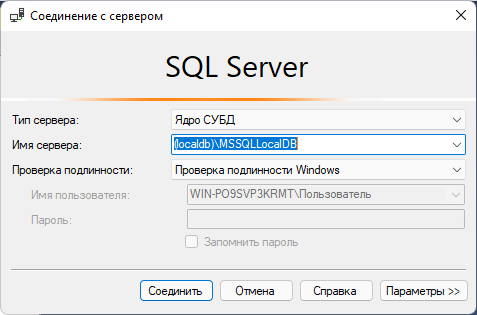

2. Список объектов баз данных 


3. Создание диаграммы баз данных ```SportStore```

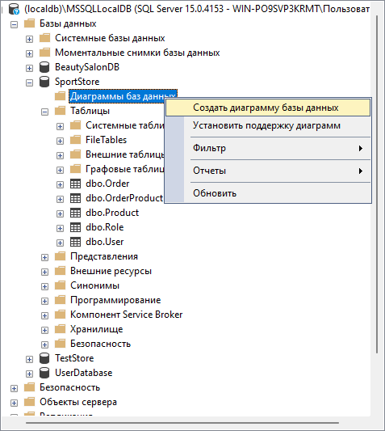

Возможная ошибка при создании диаграммы


Cвойства базы данных => Файлы => Владелец: sa

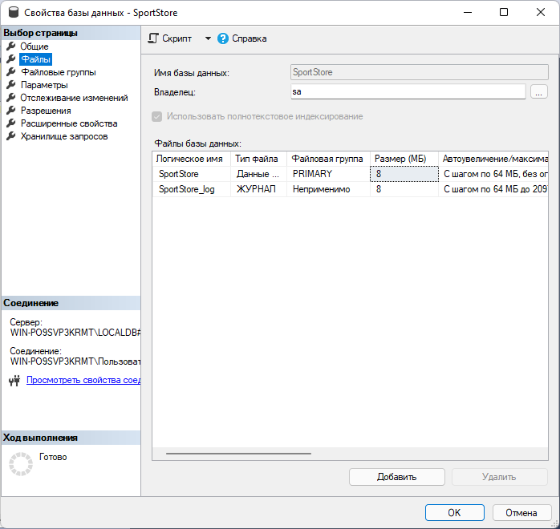

4. Создание диаграммы баз данных

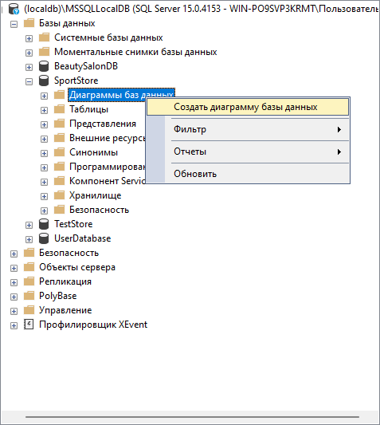

5. Выбор таблиц

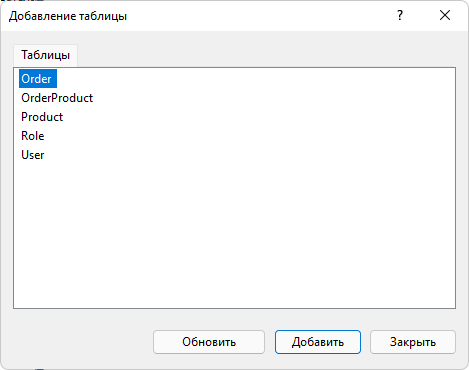

6. Создание диаграммы ERD (для сохранение ПКM => Копировать в буфер)


# Анализ файлов данных xls

В исходных файлах для импорта проверьте соответствие таблицам в базе данных. Все поля и последовательность полей в таблицах базы данных на сервере должны быть отражены в исходных данных. При необходимости отредактируйте исходные данные (добавление или удаление столбцов, редактирование данных в столбцах, перестановка столбцов, добавление столбцов для поля ```id```).

## Таблица ```User```

Данные для таблицы User

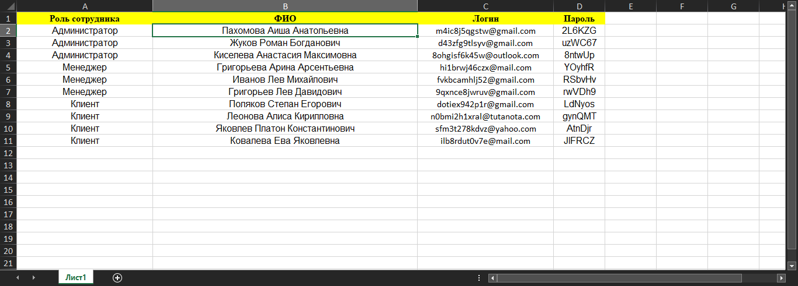

Таблица ```User``` в базе данных


Требуется разбить ФИО на три поля, а также в качестве ролей вместо строковых значений поставить значения связанной таблицы ```Role``` в виде внешних ключей числового типа.

Вставка ```Id```


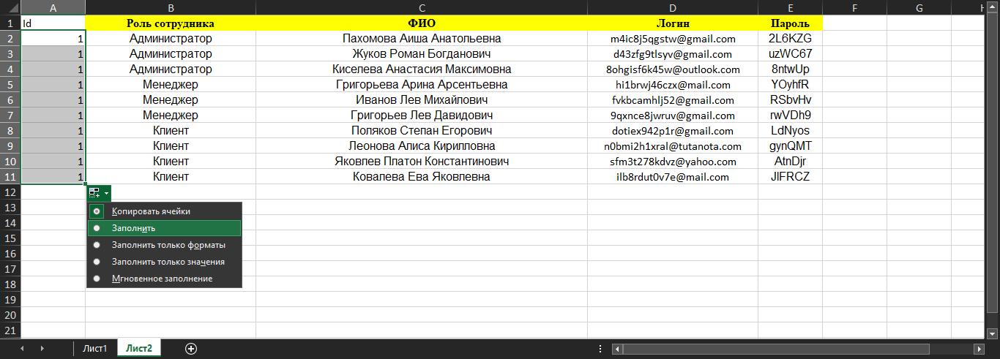

Разбиения данных на столбцы


# Таблица ```Role```

Таблица ролей

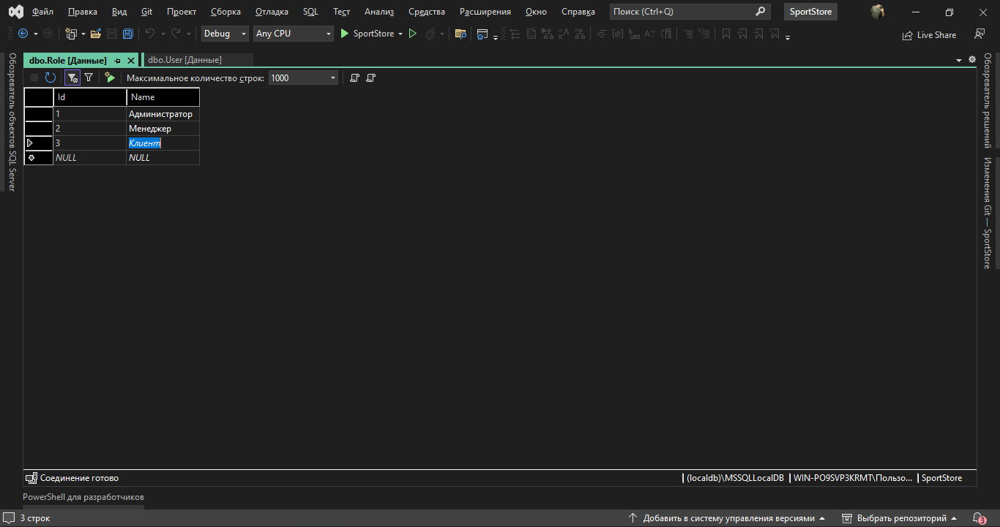

Отредактированные данные для таблицы ```User```

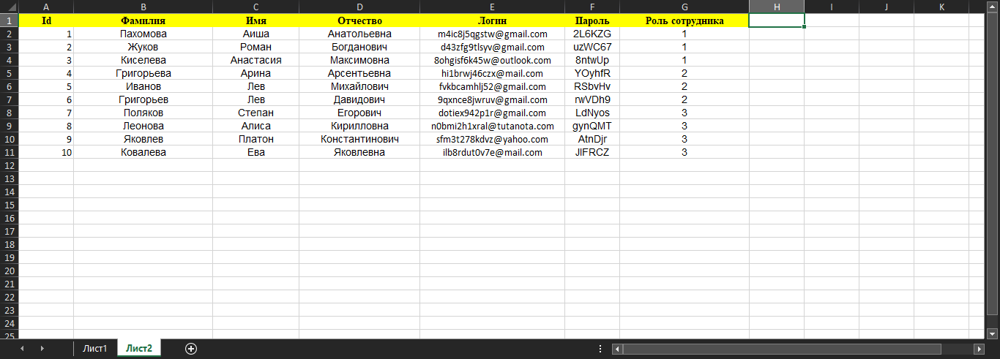

Перемещение столбца


Готовая таблица ```User``` в базе данных

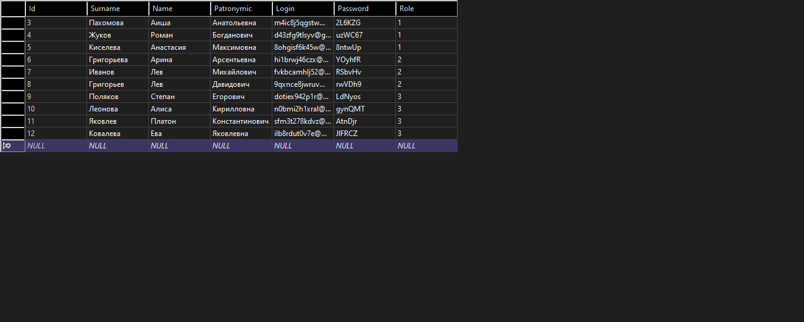


# Таблица ```Order```

Данные для таблицы ```Order``


Таблица ```Order``` в базе даннных


Очевидно, что в базу данных надо добавить дополнительные столбцы

Открытие контруктора таблицы


Добавление новых столбцов в таблицу ```Users```


Применение обновления


Процесс обновления


Успешное завершение обновления


Таблица ```Order``` c данными


# Таблица ```PickupPoint```


Разделение по столбцам


Создание таблицы ```PickupPoint```


Данные для таблицы ```PickupPoint```


Таблица ```PickupPoint``` с данными


Добавление внешнего ключа в таблице ```Order``` к таблице ```PickupPoints```


# Таблица ```Products```


Исходное положение столбцов в таблице ```Products``` в базе данных


Обновление таблицы продукты 


Отредактированные данные для таблицы ```Product```


Таблица ```Product``` c данными


Создание скрипта базы данных ```SportStore``` c данными


# Создание локального репозитория

1. Создайте локальный репозиторий из папки с решением ```SportStore```.
2. Проинициализируйте репозиторий командой ```git init```
3. Свяжите локальный и удаленный репозитории командой ```git remote add origin <ссылка на удаленный репозиторий>```
4. Пропишите локальный конфиг: 
    ```git config --local user.name "ФИО студента"```
    ```git config --local user.email "Группа студента@git.scc"```
5. Скачайте с удаленного репозитория в локальные файлы ```.gitignore``` и ```README.md``` командой ```git pull origin master```
6. Скачайте в ресурсах файл ```README-template-rus.md``` и напишите свой ```README.md``` в соответствии с шаблоном.
7. Добавьте в локальный репозиторий файлы ```database.sql```,```SportStore.sql``` и ERD-диаграмму.
8. ```git add .```
9. ```git commit -m "Intro"```
10. ```git push origin master``` или (```git push origin master -f```)
11. Проверьте синхронизацию локального и удаленного репозиториев.


